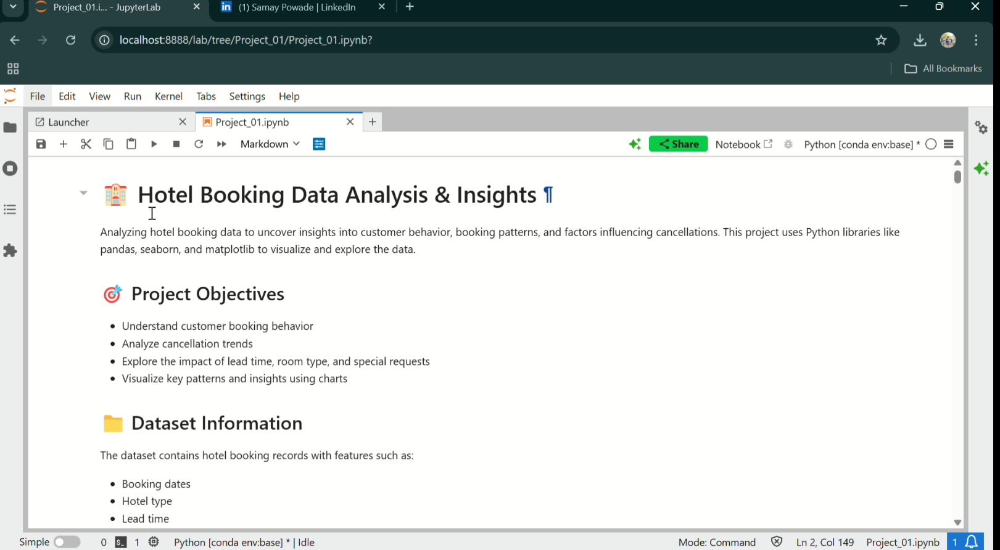

# hotel-booking-insights
Analyzed hotel booking data to uncover trends in cancellations, guest behavior, and seasonal demand. Visualized key insights using Python, Pandas, and Seaborn to support data-driven decision-making in the hospitality industry.

My 
that is very imp one 

